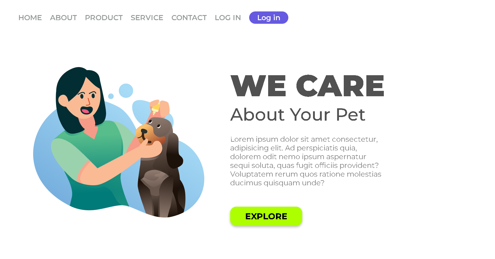

# We Care Pet

<p align="center">
 
  
  
</p>


Landing page para um serviço de cuidados com pets, desenvolvida como parte do programa **DevClub**.

## 📋 Sobre o Projeto

**We Care Pet** é uma página de apresentação (landing page) moderna e responsiva para um negócio voltado ao cuidado e bem-estar de animais de estimação. O projeto demonstra habilidades em HTML5 semântico, CSS3 moderno e design responsivo.

## 🎯 Funcionalidades

- **Header responsivo** com navegação e botão de login
- **Seção Hero** com imagem principal e call-to-action
- **Design moderno** com tipografia personalizada (Google Fonts)
- **Estilização consistente** com variáveis de cores e espaçamento
- **Efeitos visuais** (sombras, bordas arredondadas, hover states)

## 🛠️ Tecnologias Utilizadas

| Tecnologia | Versão | Uso |
|------------|--------|-----|
| HTML5 | - | Estrutura semântica |
| CSS3 | - | Estilização e layout |
| Google Fonts | - | Tipografia (Montserrat, IBM Plex Mono, Playfair Display SC, Roboto Mono, Roboto) |

## 📁 Estrutura do Projeto

```
projeto-pet-DevClub/
├── index.html          # Página principal
├── styles.css          # Estilos globais
└── img/
    └── Illustration 2.png   # Imagem da seção hero
```

## 🚀 Como Executar

1. Clone o repositório:
   ```bash
   git clone <url-do-repositorio>
   ```

2. Navegue até a pasta do projeto:
   ```bash
   cd projeto-pet-DevClub
   ```

3. Abra o `index.html` no navegador (duplo clique ou use uma extensão como Live Server no VS Code)

## 🎨 Paleta de Cores

| Cor | Hex | Uso |
|-----|-----|-----|
| Roxo Principal | `#665ae1` | Botões primários, header |
| Verde Limão | `#adff00` | Botão CTA principal |
| Cinza Escuro | `#515151` | Títulos principais |
| Cinza Médio | `#848484` / `#989d9c` | Textos secundários, navegação |
| Branco | `#ffffff` | Textos em botões escuros |

## 📱 Responsividade

> **Nota:** O projeto atualmente possui layout fixo (valores em px). Para torná-lo totalmente responsivo, recomenda-se:
> - Usar unidades relativas (`rem`, `em`, `%`, `vw`, `vh`)
> - Adicionar media queries para breakpoints
> - Implementar `flex-wrap` e `grid` para reorganização de conteúdo


## 👨‍💻 Autor

Desenvolvido durante o programa **DevClub** como exercício prático de HTML/CSS.

---

## 📄 Licença

Este projeto está sob a licença MIT. Veja o arquivo [LICENSE](LICENSE) para mais detalhes.